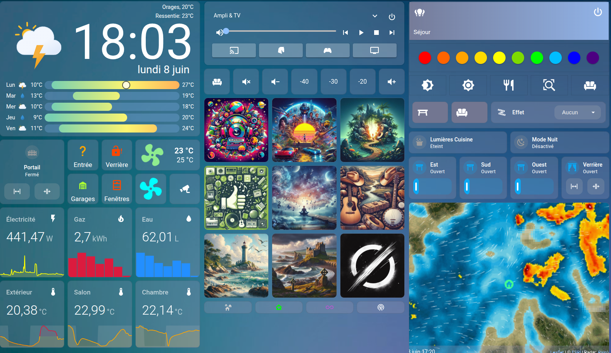
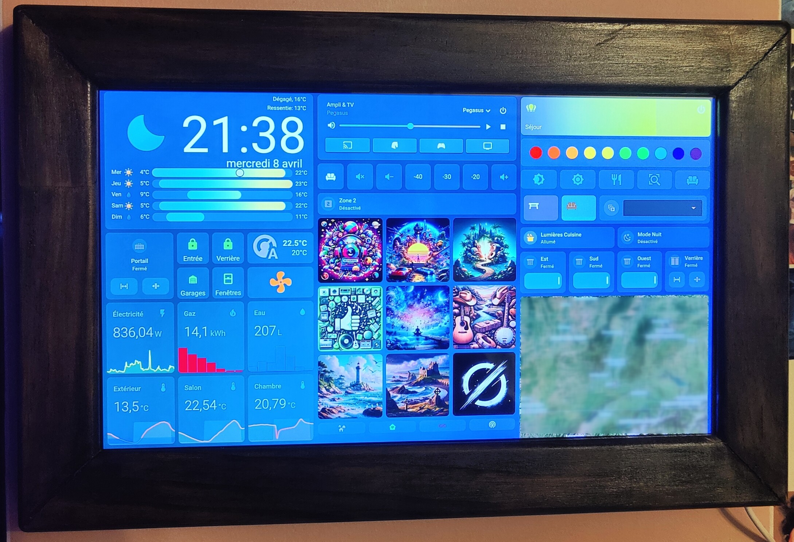
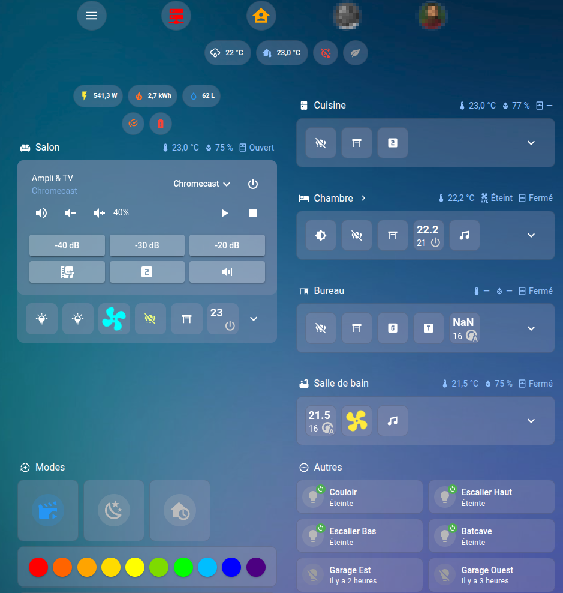
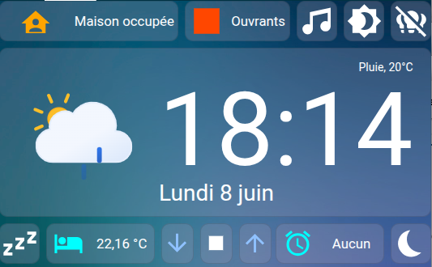
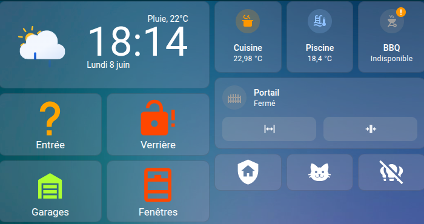

# Home Assistant Configuration

Personal smart home configuration running on [Home Assistant](https://www.home-assistant.io/), hosted on a self-managed home server (Lyra).
This instance is live since 2022.
This repository contains automations, scripts, templates, dashboards, and integrations for a multi-room smart home setup. All secrets are excluded via `.gitignore` — a `secrets.yaml.example` file is provided as a reference.

---

## Overview

| Category | Count |
|----------|-------|
| Running PROD instances | 3 |
| Entities | 3177 |
| Automations | 147 |
| Scripts | 57 |
| Custom components | 26 |
| Lovelace dashboards | 15 |
| Small kiosk dashboards | 5 |
| Main kiosk dashboard | 1 |
---

## Highlighted Automations & Scripts

A selection of the most interesting or complex behaviors across the ~147 automations and ~57 scripts.

### Frigate person detection with actionable push notifications
`packages/security.yaml`

When Frigate detects a person above a configurable confidence threshold, the system sends two successive push notifications to all household members present at home: a static snapshot 10 seconds after detection and an animated GIF preview once it's available. Each notification carries three action buttons — trigger the alarm immediately, close all shutters, or silence detection on that specific camera. The camera name is embedded dynamically into the action event, so the same automation handles all cameras. A cooldown timer prevents flooding during sustained activity.

### Multimedia scene automation — video playback
`automations/multimedia.yaml`

When playback starts on the TV or Plex, the system checks a set of conditions before acting: it verifies that the living room lights are on, that the sun is below the horizon or the shutters are closed, and that the multimedia system is in the right state. If all conditions are met, it disables Zone 2 audio on the amplifier, adjusts the Denon AVR volume to the preferred video level (stored in an `input_number`), activates the TV backlight (RGB bias light), and switches the living room to a dimmed scene. When playback stops, the scene reverses: lights return to normal and the amplifier switches back to music volume.

### Garage return-home flow with alarm awareness
`packages/security.yaml`

The *Retour Maison* scripts handle arriving home via the garage. The logic branches on two axes — whether the house is occupied and whether the alarm is armed. If the house is occupied and the alarm is disarmed, the gate and garage door open immediately with the light. If the alarm is armed or the house is empty, a push notification is sent asking for confirmation with a Yes/No action button before opening anything, preventing accidental disarms or entries.

### Context-aware presence avatars
`packages/security.yaml`

The template binary sensors for each household member pick a different profile picture depending on context: sleeping (phone charging wirelessly or Do Not Disturb active), home and awake, at a known workplace (detected by GPS zone), away with approximate location, or away with unknown location. This feeds directly into the dashboard person cards.

### Insomnia mode
`automations/modes.yaml`

A single boolean toggle (`input_boolean.mode_insomnie`) disables six automations (motion lights, presence announcements, gate/garage notifications), turns off the multimedia switch, and prevents the scheduled morning shutter opening. Toggling it off restores every automation and re-enables the shutter schedule.

### Notification & TTS pipeline
`scripts/notifications.yaml`

Two reusable scripts (`notify_all` and `notify_tts`) form the notification backbone used throughout the configuration. `notify_all` routes push notifications to specific people, to those currently home, or to all devices, with support for up to four action buttons, an image or video attachment, a color, a priority, a clickable dashboard link, and a TTL. `notify_tts` handles Google Cloud TTS announcements on the speaker group, with per-person Do Not Disturb awareness and a queued mode (max 10) to serialize concurrent announcements. `notify_all_tts` combines both into a single call.

### Persistent open-window alert
`automations/notifications.yaml`

During winter, if a bathroom window is left open and the temperature drops below 18 °C for more than one minute, the system announces a TTS warning and then repeats the reminder every two minutes in a `repeat/while` loop until the window is actually closed. The washing machine done notification uses the same approach, calculating and announcing the elapsed cycle duration from the sensor's `last_changed` timestamp.

### Smart amplifier power-on
`scripts/multimedia.yaml`

Turning on the TV involves two scripts chained conditionally. If the power strip (multimedia switch) is off, it powers it on and waits 20 seconds for devices to boot before proceeding. If it's already on, it goes straight to a retry loop that calls `media_player.turn_on` on the Denon AVR every 5 seconds until the player confirms it is in the `on` state — handling the slow network boot of the receiver without hardcoded sleep delays.

---

## Automations by domain

`automations/` — split by concern:

| File | Count | Domain |
|------|-------|--------|
| `lights.yaml` | 8 | Configurable-timer auto-off for 4 motion zones |
| `motion.yaml` | 6 | Motion-triggered light activation |
| `multimedia.yaml` | 7 | Video/music playback scene transitions |
| `notifications.yaml` | 7 | Alerts: temperature, appliances, backups, presence |
| `presence.yaml` | 5 | Away/home mode switching |
| `modes.yaml` | 1 | Insomnia mode |
| `ui.link.yaml` | ~120 | Tradfri remote and Zigbee button bindings |
| `packages/security.yaml` | — | Alarm panel, cameras, garage/gate flows, siren |

## Scripts by domain

`scripts/` — reusable sequences callable from automations and the UI:

| File | Count | Domain |
|------|-------|--------|
| `lights.yaml` | 5 | Named living room scenes (normal, dim, RGB) |
| `multimedia.yaml` | 41 | TV/amplifier on/off/source/volume/zone control |
| `notifications.yaml` | 14 | Push notification routing and TTS delivery |
| `others.yaml` | 2 | Miscellaneous helpers |
| `packages/security.yaml` | — | Alarm, siren, surveillance activation, garage flows |

---

## Templates

Custom template entities under `templates/`:

- **sensors.yaml** — timers, location tracking, elapsed mode times, composite states
- **binary_sensors.yaml** — condition checks, window/door combined states
- **lights.yaml** — lighting state helpers and scene detection
- **covers.yaml** / **switches.yaml** — virtual cover and switch entities

---

## Integrations & Devices

### Built-in integrations (via `configuration.yaml`)

- **ZHA** (Zigbee) with custom device quirks (`custom_zha_quirks/`)
- **MQTT** with template sensors
- **Google Assistant** — 40+ entities exposed with voice control
- **Google Cloud TTS** — French voice (Wavenet fr-FR)
- **ESPHome** — 8 custom ESP devices
- **Bluetooth** — device tracking and presence
- **OpenID** — SSO authentication

### Custom components (HACS + manual)

| Component | Purpose |
|-----------|---------|
| [Alarmo](https://github.com/nielsfaber/alarmo) | Full alarm panel with zones, codes, and notifications |
| [Bambu Lab](https://github.com/greghesp/ha-bambu-lab) | Bambu X1C 3D printer monitoring |
| [Moonraker](https://github.com/marcolivierarsenault/moonraker-home-assistant) | Klipper/Voron 3D printer control |
| [Frigate](https://github.com/blakeblackshear/frigate) | Local NVR — camera events, object detection |
| [Wiser](https://github.com/asantaga/wiserHomeAssistantPlatform) | Drayton Wiser multi-room heating |
| [LocalTuya](https://github.com/rospogrigio/localtuya) | Local control of Tuya/Smart Life devices |
| [Nanoleaf](https://github.com/ianbonnell/hass-nanoleaf) | Nanoleaf light panels |
| [Navimow](https://github.com/abmantis/ha-navimow) | Husqvarna Navimow robotic mower |
| [Xiaomi Cloud Map Extractor](https://github.com/PiotrMachowski/Home-Assistant-custom-components-Xiaomi-Cloud-Map-Extractor) | Live Xiaomi robot vacuum maps |
| [YouTube Music Player](https://github.com/KoljaWindeler/ytube_music_player) | YouTube Music integration |
| [Browser Mod](https://github.com/thomasloven/hass-browser_mod) | Browser popup/navigation automation |
| [Remote Home Assistant](https://github.com/custom-components/remote_homeassistant) | Bridge to secondary HA instance |
| [Monitor Docker](https://github.com/ualex73/monitor_docker) | Docker container stats and control |
| [Beszel API](https://github.com/CanadaApollo6/beszel-ha) | Server monitoring via Beszel |
| [Composite](https://github.com/pnbruckner/ha-composite-tracker) | Composite device tracker (GPS + WiFi) |
| [Scheduler](https://github.com/nielsfaber/scheduler-component) | Advanced time-based scheduling |
| [Home Maintenance](https://github.com/bmcclure/ha-home-maintenance) | Maintenance interval tracking |
| [Activity Manager](https://github.com/Horizon0156/ha-activity-manager) | Scene/activity management |
| [ZHA Toolkit](https://github.com/mdeweerd/zha-toolkit) | Advanced Zigbee device management |
| [Spook](https://github.com/frenck/spook) | Extra HA features and entity management |
| [HACS](https://hacs.xyz/) | Community store |
| Apparent Temperature | Feels-like temperature sensor |
| Gicisky | E-ink badge display |
| OpenID | OpenID Connect authentication provider |
| Retry | Retry logic wrapper for automations |
| Whats That Plane | Aircraft ADS-B tracking |

---

## Dashboards

Nine Lovelace dashboards:

| Dashboard | Purpose |
|-----------|---------|
| Main (`lovelace`) | Home overview — weather, presence, quick controls |
| Heating (`dashboard_chauffage`) | Multi-room heating controls and schedules |
| Security (`dashboard_securite`) | Alarm panel, cameras, locks, door/window sensors |
| Transports (`dashboard_transports`) | Real-time tram/bus departures |
| Garden (`dashboard_jardin`) | Outdoor sensors, mower, irrigation |
| Map (`dashboard_carte`) | Household member location map |
| Persons (`lovelace_personnes`) | Per-person presence and status |
| 3D Printers (`imprimantes_3d`) | Bambu Lab + Klipper printer monitoring |
| Infrastructure (`lovelace_infrastructure`) | Server health, Docker containers, network |

---

## Kiosks

* 5 small kiosks (4-inches)
* 1 main kiosk (11-inches)

---

## Screenshots

### Main kiosk display





### Mobile dashboard



### Small kiosks




---


## Repository Structure

```
├── automations/          # Automations by domain
├── scripts/              # Scripts by domain
├── templates/            # Template entities (sensors, binary_sensors, covers, switches)
├── packages/             # Package files (security, legacy Tradfri bindings)
├── mqtt/                 # MQTT sensor definitions
├── themes/               # UI themes
├── custom_zha_quirks/    # Custom Zigbee device quirks
├── www/                  # Lovelace frontend assets (fonts, images, custom JS)
├── .storage/             # Lovelace dashboard YAML definitions
├── configuration.yaml    # Main HA configuration
├── automations.yaml      # Include entry point for automations/
├── scripts.yaml          # Include entry point for scripts/
├── sensors.yaml          # Platform-based sensor definitions
├── switches.yaml         # Platform-based switch definitions (Broadlink IR, WoL)
├── rest.yaml             # REST sensor integrations
└── secrets.yaml          # Secrets (gitignored — see secrets.yaml.example)
```

---

## Setup Notes

- Runs inside Docker on a home server
- MariaDB recorder backend
- Zigbee via ZHA (USB coordinator)
- All sensitive values are in `secrets.yaml` and excluded from version control